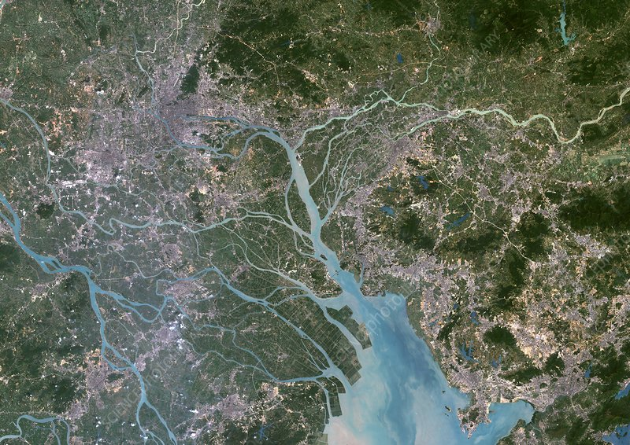

```{r setup, include=FALSE}
knitr::opts_chunk$set(echo = FALSE)

library(here)
library(dplyr)
admin_area <- read.csv(here("data_output/03_cities_extent.csv"))

```

```{r extent}

admin_area <- admin_area %>%
  arrange(desc(area_km2))%>%
  select(-X)

cities <- admin_area$city
lcity <- admin_area$city[1]
scity <- admin_area$city[length(admin_area$city)]
larea <- round(admin_area$area_km2[1],2)
sarea <- round(admin_area$area_km2[length(admin_area$area_km2)],2)
prdarea <- sum(admin_area$area_km2)

```

## Introduction

The Pearl River Delta (PRD) is one of the most important urbanized regions in China and worldwide, known for its econonic importance and high population density. This deltaic region encompassess cities like Guangzhou, Shenzhen and Zhuhai, and includes the special administrative regions of Hong Kong and Macau. The PRD is a major global economic hub, characterized by rapid industrialization and urbanization, making it one of the wealthiest regions in China, but also increasing its vulnerability to the impacts of climate change. It is a special economic zone in China, and its considered a megacity due to its dense population and urban development.

{#id .class width=50% height=50%}

## The Pearl River Delta

The PRD is composed by 9 cities and 2 Special Economic Zones (SEZs): `r cities`. The total extent of the PRD is `r prdarea` square kilometers. The largest city in the PRD is `r lcity` (`r larea` km2), while the smallest is `r scity` (`r sarea` km2).

```{r}
library(ggplot2)
library(sf)
library(forcats)
library(leaflet)


cities <- read_sf(here("data/admin_bound.shp"))

cities <- st_transform(cities, 4326)
st_bbox(cities)
xmin<- as.numeric(st_bbox(cities)[1])
xmax<- as.numeric(st_bbox(cities)[3])
xavg <- (xmin+xmax)/2
ymin<- as.numeric(st_bbox(cities)[2])
ymax<- as.numeric(st_bbox(cities)[4])
yavg <- (ymin+ymax)/2


m = leaflet() %>%
  setView(xavg, yavg, zoom = 7) %>%
  addProviderTiles(providers$CartoDB.Positron)%>%
  #addProviderTiles(Stadia.AlidadeSmoothDark)%>%
  #addProviderTiles(Jawg.Dark)%>%
  addPolygons(
    data=cities,
    fillColor = topo.colors(12, alpha = NULL),stroke=FALSE,
    popup = cities$NAME_2
  )
m  # a map with the default OSM tile layer


admin_area %>%
  mutate(city = fct_reorder(city, area_km2))%>%
  ggplot(aes(x=city, y=area_km2, label=round(area_km2,2)))+
  geom_point()+
  geom_segment(aes(x=city,
                   xend=city,
                   y=0,
                   yend=area_km2))+
  geom_point(size=3, colour = "white")+
  geom_text(hjust=-0.35, vjust=0.5, size=2)+
  theme_minimal()+
  labs(title="Cities in the Pearl River Delta",
       subtitle="Extent of the cities in the PRD region, in square kilometers",
       caption="bla",
       y = "area (km2)") +
  coord_flip()+
theme(axis.ticks.x=element_blank(), 
      axis.ticks.y=element_blank(),
      axis.title.y= element_blank(),
      axis.text = element_text(size=6),
      axis.title = element_text(size=8))
      
```

### Total Area

### Population

## Land Cover Trends
